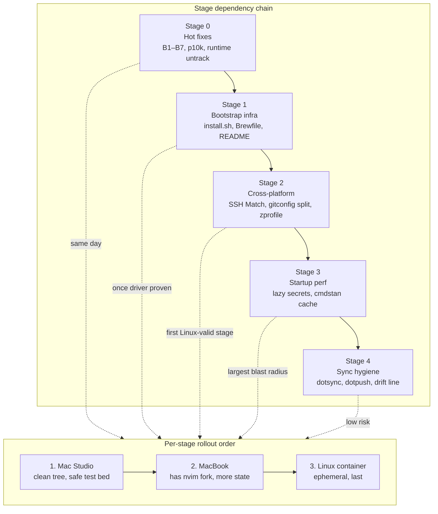

# Dotfiles overhaul — execution plan

> Synthesis of `docs/dotfiles-audit-macbook.md` and `docs/macstudio-dotfiles-audit.md`.
> Merged 2026-04-20. Authoritative once landed — implementers should work from this
> file and stop re-reading the two audits.

## Executive summary

- **Why.** Two pain points: (1) zsh startup is 3–7 s cold, driven by `Rscript`
  + sequential `op read` calls at shell init (issue #2); (2) three-machine drift
(macbook, mac studio `vepopo`, ephemeral Linux) with no bootstrap, no `Brewfile`, no drift signal.
- **What.** Five staged PRs: (0) hot fixes; (1) `install.sh` + `Brewfile` +
README rewrite; (2) cross-platform robustness (SSH `Match`, gitconfig split, `.zprofile` Linux branch); (3) startup-perf + lazy 1Password secrets; (4) lightweight drift detection (`dotsync` / `dotpush`).
- **Rules the user already set.** Secrets lazy by default; `git` + `gh` must
stay prompt-free. Retire `p10k/`. Keep `rstudio/`. Repo layout (Stow + XDG) stays — no chezmoi / yadm / nix migration.
- **Roll-out.** Mac Studio first → MacBook second → Linux container last, per
stage. Target warm `zsh -i -c exit` < 300 ms after Stage 3.
- **Scope boundaries.** No prompt-badge drift detection. No autopush cron.
No new abstractions where existing ones fit (`claude()` is the lazy-secret template; `add_to_path` is the PATH helper; `FUNCTIONS_ZSH_LOADED` is the double-source guard).

---

## 1. Reconciled findings

Every claim below was re-verified against the live tree on macbook (`/Users/venpopov/dotfiles`) on 2026-04-20 via `git ls-files`, `Read`, and `Grep`. `VERIFIED` = true as written. `CONTESTED` = the two audits disagreed; the resolution column states the truth. `UNVERIFIED` = the claim needed a Linux box or a macstudio shell to confirm and neither was available during the merge session.

### 1.1 Bugs (fix in Stage 0)

| # | Location | Claim | Status | Resolution |
|---|---|---|---|---|
| B1 | `zsh/.config/zsh/.zshrc:31` | `[ -f "/Users/venpopov/.ghcup/env" ]` — hardcoded path | **VERIFIED** (both audits) | Replace with `${HOME}`. Path is live on macbook because local user matches; dead on macstudio (`vepopo`). |
| B2 | `zsh/.config/zsh/exports.zsh:15` | Single-quoted `'$HOME/.opam/...'` never expands → OPAM init silently no-ops | **VERIFIED** (macstudio flagged, macbook missed) | Replace `'...'` with `"..."`. |
| B3 | `zsh/.config/zsh/exports.zsh:14` | Unconditional `$(Rscript --vanilla -e 'cat(cmdstanr::cmdstan_path())')` — spawns R every shell, breaks without `Rscript` | **VERIFIED** | Gate with `command -v Rscript`; then cache (Stage 3). |
| B4 | `zsh/.config/zsh/functions.zsh:32` | `destroy_github_repo` calls `Rscript` unguarded | **VERIFIED** | Gate with `command -v Rscript`. |
| B5 | `1Password/.config/.../.DS_Store` (×2) | macstudio claims two `.DS_Store` **tracked** in `1Password/` | **CONTESTED → FALSE** | `git ls-files \| grep -i DS_Store` returns **zero**. macbook audit was right. Only `1Password/.DS_Store` exists **on disk, untracked** (covered by `git/.gitignore_global`). No `git rm --cached` needed. |
| B6 | `ssh/.ssh/config:2` | Global `IdentityAgent "~/Library/Group Containers/.../agent.sock"` — macOS-only; breaks ssh on Linux when stowed | **VERIFIED** (macstudio flagged, macbook missed) | Wrap in `Match exec "uname -s \| grep -q Darwin"` (Stage 2). |
| B7 | `git/.gitconfig:7` | `[gpg "ssh"] program = /Applications/1Password.app/...` — macOS-only | **VERIFIED** | Move to `~/.config/git/config.local` stowed only on macOS, or `includeIf` (Stage 2). `commit.gpgsign = false` masks the breakage today. |

### 1.2 Cruft (fix in Stage 0 / Stage 1)

| # | Location | Claim | Status | Resolution |
|---|---|---|---|---|
| C1 | `p10k/.p10k.zsh` + `.zshrc:12–17` | Powerlevel10k block fully commented; `p10k/` package exists but inert | **VERIFIED** | User decision: **retire.** Delete `p10k/`, delete commented block. |
| C2 | `.gitignore` (root) | Hardcoded UUID paths (`22E18652-...`, `AE0A61C3-...`) — won't catch new session UUIDs on fresh machines | **VERIFIED** | Replace with globs. |
| C3 | `zsh/.config/zsh/.zcompdump`, `zsh/.config/zsh/.zsh_sessions/_expiration_check_timestamp` | Tracked runtime files — stow would overwrite machine-local versions | **VERIFIED** | `git rm --cached` both; they stay on disk. Globs from C2 prevent re-track. |
| C4 | `prompts/` | Empty stow package — `stow prompts` is a no-op | **VERIFIED** | Delete (or populate). Safer to delete; easy to re-add. |
| C5 | `README.md` | 14-line install with wrong clone path (`.dotfiles`) | **VERIFIED** | Rewrite in Stage 1 to point at `install.sh`. Actual remote is `git@github.com:venpopov/.dotfiles.git`, so `.dotfiles` clone path is actually correct — but the README still misses prereqs, platform notes, bootstrap. |
| C6 | `~/.zshrc` (not repo), `~/.bashrc`, `~/.profile` | Legacy `$HOME` dotfiles — `~/.zshrc` is 0 B (obsolete since `ZDOTDIR`); `.bashrc` (415 B) and `.profile` (103 B) have envman/juliaup/cargo/ghcup exports that duplicate `exports.zsh` | **VERIFIED** (macbook). **UNVERIFIED** on macstudio (has untracked `~/.profile` 35 B) | Host-side cleanup, not repo. Bootstrap can `rm ~/.zshrc` only after confirming it's empty. |
| C7 | `zsh/.config/zsh/.zshrc:6–10` | Zinit bootstrap runs every shell; **no `zinit light/load/ice` anywhere** → loads nothing, costs ~0.1 s | **VERIFIED** (macbook) | With p10k retired, delete the zinit block. Revisit only if we later want zsh-syntax-highlighting / zsh-autosuggestions. |

### 1.3 Startup tax (fix in Stage 3)

Measured on macbook 2026-04-20: cold 5.7 s, warm ≈ 2.9 s (5 runs, median).

| Source | Call | Cost | Notes |
|---|---|---|---|
| `exports.zsh:14` | `Rscript --vanilla -e 'cat(cmdstanr::cmdstan_path())'` | 0.8–2.0 s | Biggest offender. Cache. |
| `exports.zsh:35` | `op read 'op://dev/VADE library bearer/password'` | 0.5–2.0 s | Prompts if vault locked. Lazy. |
| `exports.zsh:36` | `op read 'op://dev/vade-app.dev/password'` | same | Sequential with the above. Lazy. |
| `exports.zsh:37` | `gh auth token` | 0.2–0.4 s | **Stays eager** (user decision). Cheap; reads from disk. |
| `exports.zsh:34` | `security find-generic-password -s mem0-vade-coo -w` | 0.05–0.15 s | macOS only. Gate with `command -v security`. Keychain on unlocked session = prompt-free; stays eager. |
| `.zshrc:26` | `source <(fzf --zsh)` | 0.2–0.4 s | Standard. Not worth replacing. |
| `.zshrc:6–10` | Zinit bootstrap | ~0.1 s | Loads nothing. Delete with p10k retirement. |

### 1.4 Cross-platform / Linux gaps (fix in Stage 2)

| # | Location | Claim | Status |
|---|---|---|---|
| L1 | `zsh/.config/zsh/.zprofile:1` | Unconditional `eval "$(/opt/homebrew/bin/brew shellenv)"` — fails on Linuxbrew (`/home/linuxbrew/.linuxbrew/bin/brew`) | **VERIFIED** |
| L2 | `zsh/.config/zsh/exports.zsh:23` | `Linux)` branch is empty — no `SSH_AUTH_SOCK`, no secret fallback | **VERIFIED** |
| L3 | `ssh/.ssh/config:2` | `IdentityAgent` global — breaks Linux ssh | **VERIFIED** (= B6) |
| L4 | macOS-only packages on Linux | `1Password/`, `rstudio/` (plus the retiring `p10k/`) stow inert files on Linux — harmless but noisy | **VERIFIED** — `bootstrap` skips via `install/linux.pkgs`. |
| L5 | `git/.gitconfig:7` | macOS path `/Applications/1Password.app/...` | **VERIFIED** (= B7) |

### 1.5 Machine asymmetries (**implementers must not assume symmetry**)

- **nvim fork, macbook only.** `nvim/.config/nvim/.git` is a real nested repo —
`venpopov/kickstart-modular.nvim` forked from `dam9000/kickstart-modular.nvim`, `origin` + `upstream` remotes, HEAD `c5b8da6`, one **uncommitted** mod at `lua/kickstart/plugins/lspconfig.lua` (VERIFIED via `git -C nvim/.config/nvim status`). Mac studio has no `~/.config/nvim` at all (VERIFIED via macstudio audit D1). Treatment is asymmetric across machines; see Stage 1 §nvim.
- **Local usernames differ.** `venpopov` (macbook) vs. `vepopo` (mac studio). Any
tracked config that references `/Users/venpopov` breaks on mac studio.
- **Drift direction.** Macbook was 5 commits behind `origin/main` at the time
the macbook audit ran (now caught up: HEAD `59a671e`). Mac studio was clean. Future sync hygiene is symmetric — either can get ahead.
- **`~/.config/nvim.bak/`** is tracked in the repo (`git ls-files` shows 5
files under `nvim/.config/nvim.bak/`). Macbook audit didn't mention this. It is dead — delete in Stage 0 housekeeping.
- **`~/.profile` contents.** Macbook: 103 B (cargo + ghcup). Mac studio: 35 B
(contents unknown per macstudio audit D2). Folding into `exports.zsh` is safe only after both inspections.

---

## 2. Staged execution plan

Each stage is one PR/commit. Every stage is a pre-requisite for the next unless noted. Rollout: mac studio → macbook → Linux test container, per stage.

### Stage 0 — Hot fixes

**Goal.** Eliminate the seven unambiguous bugs (B1–B7 except B5 which turned
out to be a false alarm) and the commented-out `p10k` block. Zero design surface; ship same day.

**Files & edits.**

1. `zsh/.config/zsh/.zshrc` — fix B1, delete p10k block, delete zinit block:

Current lines 6–17 and line 31:

```zsh # Setup Zinit ZINIT_HOME="${XDG_DATA_HOME:-${HOME}/.local/share}/zinit/zinit.git" [ ! -d $ZINIT_HOME ] && mkdir -p "$(dirname $ZINIT_HOME)" [ ! -d $ZINIT_HOME/.git ] && git clone https://github.com/zdharma-continuum/zinit.git "$ZINIT_HOME" source "${ZINIT_HOME}/zinit.zsh"

# Enable Powerlevel10k instant prompt. To customize prompt, run `p10k configure` or edit ~/.p10k.zsh. # if [[ -r "${XDG_CACHE_HOME:-$HOME/.cache}/p10k-instant-prompt-${(%):-%n}.zsh" ]]; then #  source "${XDG_CACHE_HOME:-$HOME/.cache}/p10k-instant-prompt-${(%):-%n}.zsh" # fi # source ~/.powerlevel10k/powerlevel10k.zsh-theme
   # [[ ! -f ~/.p10k.zsh ]] || source ~/.p10k.zsh
... [ -f "/Users/venpopov/.ghcup/env" ] && . "/Users/venpopov/.ghcup/env" # ghcup-env ```

Replaces with: delete lines 6–17 entirely; change line 31 to

```zsh [ -f "${HOME}/.ghcup/env" ] && . "${HOME}/.ghcup/env" # ghcup-env ```

2. `zsh/.config/zsh/exports.zsh` — fix B2 (OPAM quoting) and B3 (Rscript guard):

Lines 14–15 currently:

```zsh add_to_path $(Rscript --vanilla -e 'cat(cmdstanr::cmdstan_path())')/bin
   [[ ! -r '$HOME/.opam/opam-init/init.zsh' ]] || source '$HOME/.opam/opam-init/init.zsh' > /dev/null 2> /dev/null
```

Replace with:

```zsh if command -v Rscript >/dev/null 2>&1; then
     add_to_path "$(Rscript --vanilla -e 'cat(cmdstanr::cmdstan_path())')/bin"
fi [[ -r "$HOME/.opam/opam-init/init.zsh" ]] && source "$HOME/.opam/opam-init/init.zsh" > /dev/null 2>&1 ```

(Stage 3 replaces the Rscript call with a cached read; Stage 0 just stops it from erroring on Linux.)

3. `zsh/.config/zsh/functions.zsh` — fix B4 (Rscript guard in `destroy_github_repo`):

Line 32 currently:

```zsh
     Rscript -e "renv::deactivate(clean = TRUE)"
```

Replace with:

```zsh
     if command -v Rscript >/dev/null 2>&1; then
       Rscript -e "renv::deactivate(clean = TRUE)"
     fi
```

4. `.gitignore` (root) — fix C2, replace UUID paths with globs:

Replace the four current lines with:

```gitignore zsh/.config/zsh/.zsh_history* zsh/.config/zsh/.zsh_sessions/ zsh/.config/zsh/.zcompdump*
   **/.DS_Store
   **/._.DS_Store
  ```

5. Untrack runtime files (C3):

```sh git rm --cached zsh/.config/zsh/.zcompdump \
                   zsh/.config/zsh/.zsh_sessions/_expiration_check_timestamp
```

   (Files stay on disk; globs above prevent re-add. Also: `git ls-files \|
grep nvim.bak` → 5 files; untrack them in the same commit: `git rm -r
   --cached nvim/.config/nvim.bak`. `nvim.bak/` directory can stay on disk;
  add it to `.gitignore` for good measure.)

6. Delete retired packages / directories:

```sh rm -rf p10k/ rm -rf prompts/          # empty stow package; restore later if needed ```

7. `CLAUDE.md:11` — remove `p10k/` and `prompts/` from the package inventory sentence. New list:

```markdown Each top-level directory (`zsh/`, `git/`, `nvim/`, `R/`, `gh/`, `ssh/`, `1Password/`, `lintr/`, `rstudio/`, `stow/`) is an independent **stow package**. ```

**Verification.**

```sh
# Before
time zsh -i -c exit         # expect 2.5–5 s warm on macbook
git ls-files | grep -E 'DS_Store|zcompdump|nvim.bak'
                            # expect zcompdump + nvim.bak matches

# After
time zsh -i -c exit         # expect small improvement (R guard alone saves nothing
                            # on Rscript-equipped hosts; big wins come in Stage 3)
git ls-files | grep -E 'DS_Store|zcompdump|nvim.bak'
                            # expect empty
stow -n -v -R zsh 2>&1 | grep -v LINK   # expect no surprises
```

On a Linux box (if one is handy before Stage 1 lands): `zsh -i -c exit` should no longer error on `Rscript not found`.

**Rollback.** `git revert <stage-0-commit>`. Runtime files remain on disk;
no host-state to restore.

**Dependencies.** None.

---

### Stage 1 — Bootstrap infrastructure

**Goal.** One command (`bash install.sh`) sets up stow on a fresh machine and
re-stows idempotently on a known one. New `README.md` points at it.

**New files.**

1. `install/Brewfile` — curated minimum. Build on macbook via `brew bundle dump --describe > /tmp/Brewfile.dump`, then trim to the used set. Seed contents (verify/prune against real state before merging):

```ruby # install/Brewfile tap "homebrew/bundle"

brew "stow" brew "neovim" brew "fzf" brew "bat" brew "ripgrep" brew "jq" brew "gh" brew "git" brew "zsh" brew "r" brew "radian" brew "quarto" brew "node" brew "uv"

cask "1password" cask "1password-cli" cask "rstudio" ```

2. `install/common.pkgs` — portable stow packages, one per line:

``` zsh git gh nvim ssh stow R lintr ```

3. `install/darwin.pkgs` — macOS additions:

``` 1Password rstudio ```

4. `install/linux.pkgs` — Linux-only subset (for now, identical to common):

``` ```

(empty — common.pkgs covers it; file exists so `--minimal` can override.)

5. `install/apt.pkgs` — Linux package bootstrap (informational; `install.sh` prints, doesn't auto-install):

``` stow neovim fzf bat ripgrep jq gh git zsh ```

6. `install/verify.sh`:

```sh #!/usr/bin/env bash # Post-stow sanity check. Exits non-zero if expected symlinks are missing. set -u fail=0 check() {
     local link="$1"
     if [[ ! -L "$link" ]]; then
       echo "MISSING SYMLINK: $link" >&2
       fail=1
     fi
} check "$HOME/.zshenv" check "$HOME/.config/zsh/.zshrc" check "$HOME/.config/zsh/exports.zsh" check "$HOME/.config/zsh/functions.zsh" check "$HOME/.gitconfig" check "$HOME/.gitignore_global" check "$HOME/.ssh/config" exit $fail ```

7. `install.sh` at repo root:

```sh #!/usr/bin/env bash # Bootstrap + idempotent re-stow driver. # Usage: #   bash install.sh [--bootstrap] [--dry-run] [--minimal] set -euo pipefail

REPO_DIR="$(cd "$(dirname "${BASH_SOURCE[0]}")" && pwd)" cd "$REPO_DIR"

BOOTSTRAP=0 DRY=0 MINIMAL=0 for arg in "$@"; do
     case "$arg" in
       --bootstrap) BOOTSTRAP=1 ;;
       --dry-run)   DRY=1 ;;
       --minimal)   MINIMAL=1 ;;
       -h|--help)
         sed -n '2,6p' "$0"; exit 0 ;;
       *) echo "unknown arg: $arg" >&2; exit 2 ;;
     esac
done

os="$(uname -s)"

read_pkgs() {
     local f="$1"
     [[ -f "$f" ]] || return 0
     grep -vE '^\s*(#|$)' "$f"
}

pkgs=() while IFS= read -r p; do pkgs+=("$p"); done < <(read_pkgs install/common.pkgs) if [[ "$MINIMAL" -eq 0 ]]; then
     case "$os" in
       Darwin) while IFS= read -r p; do pkgs+=("$p"); done < <(read_pkgs install/darwin.pkgs) ;;
       Linux)  while IFS= read -r p; do pkgs+=("$p"); done < <(read_pkgs install/linux.pkgs) ;;
     esac
fi

if [[ "$BOOTSTRAP" -eq 1 ]]; then
     case "$os" in
       Darwin)
         if ! command -v brew >/dev/null 2>&1; then
           echo "install brew first: https://brew.sh" >&2; exit 1
         fi
         echo "==> brew bundle"
         [[ "$DRY" -eq 1 ]] && echo "(dry-run)" || brew bundle --file=install/Brewfile
         ;;
       Linux)
         echo "==> apt packages (install manually):"
         cat install/apt.pkgs
         ;;
     esac
fi

   stow_flag=$([[ "$DRY" -eq 1 ]] && echo "-n" || echo "")
for pkg in "${pkgs[@]}"; do
     if [[ -d "$pkg" ]]; then
       echo "==> stow $pkg"
       stow $stow_flag -v --target="$HOME" --restow "$pkg"
     else
       echo "skip: $pkg (not present)"
     fi
done

bash install/verify.sh ```

Make executable: `chmod +x install.sh install/verify.sh`.

8. `README.md` — full rewrite. Target ~60–90 lines:

```markdown # dotfiles

Personal dotfiles, deployed to `$HOME` via GNU Stow. Same repo works on macOS (macbook + mac studio) and ephemeral Linux cloud servers.

## Quick start

### macOS (fresh machine)

       # install brew first — https://brew.sh
       git clone git@github.com:venpopov/.dotfiles.git ~/.dotfiles
       cd ~/.dotfiles
       bash install.sh --bootstrap

### Linux (ephemeral cloud server)

       # apt: see install/apt.pkgs
       git clone git@github.com:venpopov/.dotfiles.git ~/.dotfiles
       cd ~/.dotfiles
       bash install.sh --minimal

### Subsequent syncs (any machine)

       bash install.sh              # idempotent re-stow
       bash install.sh --dry-run    # see what would change

## Layout

See `CLAUDE.md` for the stow-package layout and zsh module wiring.

## Secrets

`git` and `gh` always work without priming. All other 1Password-backed secrets are lazy — call `library_bearer`, `vade_auth_token`, or `claude` at use site. `op signin` prompts then, not on shell startup.

## Conventions

   - Don't add top-level dotfiles at the repo root — they won't be stowed.
   - Use `$HOME`, `$XDG_CONFIG_HOME`, `$ZDOTDIR` — never `/Users/venpopov`.
   - Platform branches use `case "$(uname -s)" in Darwin) ... ;; Linux) ... ;;`.
  ```

**§nvim (asymmetric).** macbook has the nested
`nvim/.config/nvim/` fork (HEAD `c5b8da6`, one uncommitted `lspconfig.lua` mod). Mac studio has no `~/.config/nvim`. Stage 1 treatment:

- **Keep as fork** (macbook audit recommendation, not contradicted).
- Commit macbook's `lspconfig.lua` change inside the nested repo before
Stage 1 lands, otherwise the first `install.sh` run on macbook is a no-op that masks the change.
- Add `nvim` to `install/common.pkgs` (already listed). On mac studio, the
first stow creates `~/.config/nvim` pointing at the fork tree — user opens nvim, kickstart bootstraps, done.
- Document the fork in CLAUDE.md under a new `## Nested repos` section:
"`nvim/.config/nvim/` is a live git checkout of `venpopov/kickstart-modular.nvim` (fork of `dam9000/kickstart-modular.nvim`). `dotsync` pulls it separately."

**Verification.**

```sh
# macbook (has every package)
bash install.sh --dry-run         # expect N re-stow lines, zero errors
bash install.sh                    # idempotent, exits 0
bash install/verify.sh             # exit 0

# mac studio (has no ~/.config/nvim yet)
bash install.sh                    # creates the symlink tree
ls -la ~/.config/nvim              # symlink farm into repo tree

# Linux container (no brew, no R, no 1Password)
bash install.sh --minimal          # no errors; only common packages stowed
bash install/verify.sh             # exits 0 (secrets/paths gated in Stage 2/3)
```

**Rollback.** Stage 1 is purely additive (new files, README rewrite). No
existing-file edits. Revert drops the new files.

**Dependencies.** Stage 0 must land first (removed packages must not be
listed in `install/*.pkgs`).

---

### Stage 2 — Cross-platform robustness

**Goal.** Same repo stows cleanly on macOS and Linux. `.zprofile` finds brew
on either OS, SSH doesn't wedge on Linux, git signing doesn't reference a `.app` bundle in tracked config.

**Files & edits.**

1. `zsh/.config/zsh/.zprofile` — currently `eval "$(/opt/homebrew/bin/brew shellenv)"`. Replace with:

```sh case "$(uname -s)" in
     Darwin)
       [[ -x /opt/homebrew/bin/brew ]] && eval "$(/opt/homebrew/bin/brew shellenv)"
       ;;
     Linux)
       [[ -x /home/linuxbrew/.linuxbrew/bin/brew ]] && \
         eval "$(/home/linuxbrew/.linuxbrew/bin/brew shellenv)"
       ;;
esac ```

2. `ssh/.ssh/config:1–2` — currently:

```sshconfig Host *
       IdentityAgent "~/Library/Group Containers/2BUA8C4S2C.com.1password/t/agent.sock"
```

Replace with:

```sshconfig
   Match host * exec "uname -s | grep -q Darwin"
       IdentityAgent "~/Library/Group Containers/2BUA8C4S2C.com.1password/t/agent.sock"
```

Leave the rest of the file (hosts `uzh-cluster`, `uzh-scicloud`, `venpopov.com`, `github.com`) as-is.

3. `git/.gitconfig:4–7` — move the macOS-only gpg-ssh program out:

Current:

```gitconfig [gpg]
       format = ssh
[gpg "ssh"]
       program = /Applications/1Password.app/Contents/MacOS/op-ssh-sign
```

Replace with:

```gitconfig [gpg]
       format = ssh
[include]
       path = ~/.config/git/config.local
```

New tracked file `git/.config/git/config.local.darwin`:

```gitconfig [gpg "ssh"]
       program = /Applications/1Password.app/Contents/MacOS/op-ssh-sign
```

New `install/verify.sh` addition (extend the existing verify): on Darwin, symlink `~/.config/git/config.local` → `config.local.darwin`. On Linux, no-op — `[include]` silently ignores missing paths, so the config stays valid. Add to `install.sh` after the stow loop:

```sh if [[ "$os" == "Darwin" ]]; then
     mkdir -p "$HOME/.config/git"
     if [[ ! -e "$HOME/.config/git/config.local" ]]; then
       ln -s "$REPO_DIR/git/.config/git/config.local.darwin" \
             "$HOME/.config/git/config.local"
     fi
fi ```

4. `zsh/.config/zsh/exports.zsh:34` — guard `security`:

Current:

```zsh export MEM0_API_KEY="$(security find-generic-password -s mem0-vade-coo -w 2>/dev/null)" ```

Replace with:

```zsh if command -v security >/dev/null 2>&1; then
     export MEM0_API_KEY="$(security find-generic-password -s mem0-vade-coo -w 2>/dev/null)"
fi ```

**Verification.**

```sh
# macOS (both machines)
bash install.sh                                   # symlinks config.local
ssh -G github.com | grep -i identityagent          # shows 1Password socket
git config --get-all --includes gpg.ssh.program    # shows op-ssh-sign path

# Linux container
bash install.sh --minimal
ssh -G github.com | grep -i identityagent          # no output (correct)
git config --get-all --includes gpg.ssh.program || true
                                                  # missing (correct); commit.gpgsign=false keeps commits working
source ~/.zprofile                                 # no error
```

**Rollback.** Revert the four edits. `~/.config/git/config.local` symlink on
macOS is a dangling link post-revert — `rm ~/.config/git/config.local` after revert.

**Dependencies.** Stage 1 (`install.sh` is the thing placing the
`config.local` symlink on Darwin).

---

### Stage 3 — Startup perf + secret timing

**Goal.** Warm `zsh -i -c exit` < 300 ms. Zero 1Password prompts until the
user runs `claude`, `library_bearer`, or `vade_auth_token`. `gh` and `git push` still work with no priming.

**User decision recap.** `git` + `gh` stay prompt-free. `GH_TOKEN`
(`gh auth token`, disk read, ≤ 0.4 s) stays eager. `MEM0_API_KEY` (Keychain on unlocked session, no prompt) stays eager but guarded (done in Stage 2). `LIBRARY_BEARER` + `VADE_AUTH_TOKEN` go lazy. `Rscript` cmdstan path gets cached.

**Files & edits.**

1. `zsh/.config/zsh/exports.zsh` — replace lines 14, 35, 36. Keep the Stage 0 Rscript guard but move the cache logic here; drop the two `op read` exports entirely.

Result (lines 14–16 and 35–37 change; rest of file intact):

```zsh # cmdstan path (cached; refresh via refresh_cmdstan_path) _cmdstan_cache="${XDG_CACHE_HOME:-$HOME/.cache}/dotfiles/cmdstan_path" [[ -s "$_cmdstan_cache" ]] && add_to_path "$(<"$_cmdstan_cache")/bin"

# ... # (lines 35–36 deleted — LIBRARY_BEARER / VADE_AUTH_TOKEN now lazy, see functions.zsh) ```

Keep line 37 (`gh auth token`) with a guard for Linux where `gh` may be missing:

```zsh if command -v gh >/dev/null 2>&1; then
     export GH_TOKEN="$(gh auth token 2>/dev/null)"
fi ```

2. `zsh/.config/zsh/functions.zsh` — append lazy-secret helpers mirroring the existing `claude()` at line 40, plus `refresh_cmdstan_path`. The `FUNCTIONS_ZSH_LOADED` sentinel at the top of the file already protects against double-define when `exports.zsh` re-sources.

Append after line 42 (`claude()` closes at line 42):

```zsh # Lazy 1Password secrets. Biometric prompt fires when you call these, # not at shell startup. No-op with a clear error if `op` isn't installed. library_bearer() {
     command -v op >/dev/null 2>&1 || { echo "op not installed" >&2; return 1; }
     op read 'op://dev/VADE library bearer/password'
}

vade_auth_token() {
     command -v op >/dev/null 2>&1 || { echo "op not installed" >&2; return 1; }
     op read 'op://dev/vade-app.dev/password'
}

# Refresh the cached cmdstan path. Run after `cmdstanr::install_cmdstan()` # or when switching R installations. refresh_cmdstan_path() {
     command -v Rscript >/dev/null 2>&1 || { echo "Rscript not found" >&2; return 1; }
     local cache="${XDG_CACHE_HOME:-$HOME/.cache}/dotfiles/cmdstan_path"
     mkdir -p "${cache:h}"
     Rscript --vanilla -e 'cat(cmdstanr::cmdstan_path())' > "$cache"
     echo "cached: $(<"$cache")"
} ```

Leave `claude()` at line 40 unchanged — the hardcoded `vade-coo-mcp-2026-04` vault item is open question #3 below.

3. **Audit consumers of the dropped env vars** before this stage lands:

```sh grep -r --include='*.{sh,zsh,py,R,js,ts,go}' \
        -e LIBRARY_BEARER -e VADE_AUTH_TOKEN \
        ~/GitHub ~/.dotfiles 2>/dev/null
```

Any consumer that currently reads these from the environment must switch to either (a) calling the function at invocation (`API_KEY=$(library_bearer) curl ...`) or (b) `op run --env-file=.env.op -- command`. This is the breakage-risk surface of Stage 3; block merge on a clean audit.

**Verification.**

```sh
# Baseline before
hyperfine --warmup 3 'zsh -i -c exit'             # expect ~2.5–3.5 s

# Ensure no stale caches on a fresh env
rm -rf "$HOME/.cache/dotfiles"

# Seed the cache (or skip — stage 3 will just no-op until refresh_cmdstan_path runs)
refresh_cmdstan_path                              # one-time per machine

# After
hyperfine --warmup 3 'zsh -i -c exit'             # target < 300 ms

# Lock 1Password, open new shell — must not prompt:
op signout --all
zsh -i -c exit                                    # no biometric prompt

# But the lazy functions still work when asked:
library_bearer | head -c 4                        # prompts + prints first 4 chars

# gh stays eager and healthy:
gh auth status && gh repo view venpopov/.dotfiles >/dev/null

# git still works with no priming (SSH via 1Password agent on macOS):
git -C ~/.dotfiles ls-remote --exit-code origin HEAD >/dev/null
```

**Rollback.** Revert the commit. Re-add `LIBRARY_BEARER` and
`VADE_AUTH_TOKEN` exports. Consumers that were migrated to function form still work (functions keep working), so rollback is partial-surface safe.

**Dependencies.** Stage 0 (Rscript guard is a prerequisite for the cache
read replacing it). Stage 2 (Linux needs the `gh` guard + `command -v security` guard already in place). The consumer audit is the gate — everything else is mechanical.

---

### Stage 4 — Sync hygiene

**Goal.** User notices drift without opening a terminal dedicated to it. One
line per shell when dirty or behind. Explicit `dotsync` / `dotpush` verbs.

**Files & edits.**

1. New file `zsh/.config/zsh/dotfiles-sync.zsh`:

```zsh # Drift detector. Sourced from .zshrc. Runs once per interactive shell, # fetches origin at most once every 4 hours.

_dotfiles_dir="${HOME}/.dotfiles"
   [[ -d "$_dotfiles_dir/.git" ]] || return 0

_dotfiles_fetch_stamp="${XDG_CACHE_HOME:-$HOME/.cache}/dotfiles/last_fetch" _dotfiles_fetch_ttl=14400    # 4h

_dotfiles_maybe_fetch() {
     mkdir -p "${_dotfiles_fetch_stamp:h}"
     local now=$(date +%s) last=0
     [[ -f "$_dotfiles_fetch_stamp" ]] && last=$(<"$_dotfiles_fetch_stamp")
     (( now - last < _dotfiles_fetch_ttl )) && return 0
     (git -C "$_dotfiles_dir" fetch --quiet origin &) 2>/dev/null
     echo "$now" > "$_dotfiles_fetch_stamp"
}

_dotfiles_status_line() {
     local ahead behind dirty
     ahead=$(git -C "$_dotfiles_dir" rev-list --count @{u}..HEAD 2>/dev/null || echo 0)
     behind=$(git -C "$_dotfiles_dir" rev-list --count HEAD..@{u} 2>/dev/null || echo 0)
     dirty=$(git -C "$_dotfiles_dir" status --porcelain 2>/dev/null | wc -l | tr -d ' ')
     if (( ahead + behind + dirty > 0 )); then
       echo "dotfiles: ahead=$ahead behind=$behind dirty=$dirty — run 'dotsync' / 'dotpush'"
     fi
}

_dotfiles_maybe_fetch _dotfiles_status_line ```

2. `zsh/.config/zsh/functions.zsh` — append:

```zsh dotsync() {
     local d="${HOME}/.dotfiles"
     git -C "$d" pull --ff-only && git -C "$d" status --short
     if [[ -d "$d/nvim/.config/nvim/.git" ]]; then
       git -C "$d/nvim/.config/nvim" pull --ff-only origin
     fi
}

dotpush() {
     local d="${HOME}/.dotfiles" msg="${1:-sync}"
     git -C "$d" add -A && git -C "$d" commit -m "$msg" && git -C "$d" push
} ```

3. `zsh/.config/zsh/.zshrc` — source the new module after the three existing sources (around line 4). Because `.zshrc` currently ends at line 31 with the ghcup line (Stage 0 fix), add before the ghcup line:

```zsh source "${ZDOTDIR:-${HOME}/.config/zsh}"/dotfiles-sync.zsh ```

**Verification.**

```sh
# Drift: set the repo 1 commit behind and open a shell
git -C ~/.dotfiles reset --soft HEAD~1
zsh -i -c exit    # expect "dotfiles: ahead=0 behind=1 dirty=0 ..."
git -C ~/.dotfiles reset HEAD@{1}

# Dirty: make an unstaged edit, open a shell
echo "# tmp" >> ~/.dotfiles/README.md
zsh -i -c exit    # expect "dotfiles: ... dirty=1 ..."
git -C ~/.dotfiles checkout -- README.md

# Clean: no output
zsh -i -c exit    # expect silence

# Fetch TTL: second run within 4h does not re-fetch
stat -f %m ~/.cache/dotfiles/last_fetch   # compare between runs
```

**Rollback.** Revert the commit. The new file and two functions disappear;
`.zshrc` source line is gone. Nothing host-side to clean up.

**Dependencies.** Stage 3 (the added `source` line is easier to place once
Stage 3's edits have settled).

---

## 3. Rollout shape



Every stage lands on mac studio first (clean, low-drift, `vepopo` catches `/Users/venpopov` regressions), then macbook (carries the nvim fork; also catches macbook-specific paths), then a throwaway Linux container (validates the `command -v` guards and `uname -s` branches).

---

## 4. Open questions — resolutions

These are the eight open questions from the macstudio audit §"Open questions to resolve in the merge" plus two surfaced by the merge. Resolved inline where a default is clearly right; marked **needs user input** where the choice is load-bearing.

1. **nvim on Mac Studio** (macstudio #1). **Resolution: install.** Stage 1's `install/common.pkgs` includes `nvim`; first `install.sh` on mac studio creates `~/.config/nvim` pointing at the fork. Rationale: the fork is the deliberate config (macbook audit confirmed `upstream` tracking), and keeping two Macs in different states is the exact drift the overhaul is supposed to kill. If user disagrees: remove `nvim` from `common.pkgs` and add it to `darwin.pkgs` + a `install/host.macbook.pkgs` override.

2. **rstudio drift** (macstudio #2). **Needs user input.** Re-stowing clobbers any machine-local RStudio prefs that diverged from `rstudio/.config/rstudio/`. Proposed AskUserQuestion phrasing:

> On each machine, compare `~/.config/rstudio/rstudio-prefs.json` (live > RStudio state) with `~/.dotfiles/rstudio/.config/rstudio/rstudio-prefs.json` > (tracked). Which one is the source of truth, or should I merge them?

Until resolved, Stage 1's `install.sh` will `--restow rstudio` which overwrites local state. Suggest: back up `~/.config/rstudio/*` to `~/.config/rstudio.bak/` as the first step of Stage 1 rollout on each Mac, then diff.

3. **`claude()` vault rotation** (macstudio #3). **Resolution: make it a variable.** `functions.zsh:41` hardcodes `vade-coo-mcp-2026-04`. Edit in Stage 3:

```zsh : ${CLAUDE_VAULT_ITEM:=vade-coo-mcp-2026-04} claude() {
     GITHUB_PAT=$(op read "op://dev/${CLAUDE_VAULT_ITEM}/credential") \
       command claude "$@"
} ```

Rotation = `export CLAUDE_VAULT_ITEM=vade-coo-mcp-2026-05` in a local shell (or one commit bumping the default). No more monthly dotfiles commits.

4. **Ephemeral Linux access pattern** (macstudio #4). **Needs user input.** Proposed AskUserQuestion phrasing:

> Ephemeral Linux servers: are they always fresh cloud images with > outbound internet, or sometimes behind a firewall / air-gapped? If > air-gapped is possible, I need to ship an offline bundle path; if
> not, `curl | bash` + `git clone` is sufficient.

Default assumption: always outbound-net. `install.sh --minimal` covers it. Revisit if user confirms air-gap.

5. **Brewfile scope** (macstudio #5). **Resolution: curated `Brewfile` now; `Brewfile.full` later.** Stage 1 seeds the curated list (~15 entries). If DR becomes a real scenario, add `brew bundle dump
   --describe > install/Brewfile.full` as a second artifact. No need for
  both on day one.

6. **Raycast / crossnote adoption** (macstudio #6). **Resolution: defer.** Raycast config is macstudio-only and known-fiddly (config dir may reject symlinks — macstudio audit flagged a 5-min probe needed). Crossnote adoption only makes sense if both Macs use it; macbook inventory marked it "Unknown." Neither is blocking. Revisit after Stage 4 lands and baseline is stable.

7. **`~/.profile` disposition** (macstudio #7). **Resolution: inspect and fold.** Macbook `~/.profile` is 103 B (cargo + ghcup). Mac studio `~/.profile` is 35 B (contents unknown). Post-Stage-0, run on each machine: `cat ~/.profile`. If the exports are already covered by `exports.zsh` + `add_to_path`, `rm ~/.profile`. If not, fold the unique lines into `exports.zsh` behind `command -v` guards, then delete. This is host-side hygiene, not a tracked-repo change.

8. **Linux `op` availability** (macstudio #8). **Resolution: clear error, not silent skip.** Stage 3's lazy wrappers already do this:
   `command -v op >/dev/null || { echo "op not installed" >&2; return 1; }`.
Silent skip would mislead the caller into thinking an API call failed for other reasons. Erroring at call site is the right default — if the user wants op on Linux, `brew install 1password-cli` via Linuxbrew or `curl` the tarball.

**New questions surfaced by the merge:**

9. **`nvim.bak/`** (macbook found 5 files tracked under `nvim/.config/nvim.bak/`). **Resolution: delete in Stage 0.** It's a pre-kickstart backup that predates the fork. Keep the directory on disk if the user wants a local reference copy, but stop tracking it.

10. **Zinit with nothing to load** (macbook §2, C7). **Resolution: delete
    the zinit block in Stage 0.** With p10k retired, zinit is sourcing
    a plugin manager that manages zero plugins. Reinstate only if a later
    need surfaces (e.g. `zsh-syntax-highlighting`). Cost of reinstating is
    3 lines — not a lock-in.

---

## 5. Critical files (union, deduplicated)

One line per file explaining what in this plan touches it. Grouped by fate.

**Edited in-place:**

- `zsh/.config/zsh/.zshrc` — Stage 0 (remove lines 6–17 zinit+p10k, fix line
31 `$HOME`); Stage 4 (add `dotfiles-sync.zsh` source line).
- `zsh/.config/zsh/exports.zsh` — Stage 0 (fix lines 14–15 Rscript guard +
OPAM quotes); Stage 2 (guard `security` at line 34 + `gh` at 37); Stage 3 (replace line 14 cmdstan with cache read, delete 35–36 `op read` exports).
- `zsh/.config/zsh/functions.zsh` — Stage 0 (guard `Rscript` at line 32);
Stage 3 (append `library_bearer`, `vade_auth_token`, `refresh_cmdstan_path`, parametrize `claude()`); Stage 4 (append `dotsync`, `dotpush`).
- `zsh/.config/zsh/.zprofile` — Stage 2 (Darwin/Linux case).
- `ssh/.ssh/config` — Stage 2 (wrap `IdentityAgent` in `Match exec ... Darwin`).
- `git/.gitconfig` — Stage 2 (remove macOS-only `gpg.ssh.program`, add
`[include] path = ~/.config/git/config.local`).
- `.gitignore` (root) — Stage 0 (UUID paths → globs).
- `CLAUDE.md` — Stage 0 (prune `p10k/`, `prompts/` from package list). Stage
1 (add `## Nested repos` section documenting the nvim fork).
- `README.md` — Stage 1 (full rewrite).

**Deleted:**

- `p10k/.p10k.zsh` and the `p10k/` directory — Stage 0.
- `prompts/` directory — Stage 0 (empty anyway).
- `zsh/.config/zsh/.zcompdump` (untrack only, file stays on disk) — Stage 0.
- `zsh/.config/zsh/.zsh_sessions/_expiration_check_timestamp` (untrack only) — Stage 0.
- `nvim/.config/nvim.bak/*` (untrack only; directory can stay on disk) — Stage 0.

**New:**

- `install.sh` — Stage 1.
- `install/common.pkgs`, `install/darwin.pkgs`, `install/linux.pkgs`,
`install/apt.pkgs`, `install/Brewfile`, `install/verify.sh` — Stage 1.
- `git/.config/git/config.local.darwin` — Stage 2.
- `zsh/.config/zsh/dotfiles-sync.zsh` — Stage 4.

**Untouched but worth noting:**

- `stow/.stow-global-ignore` — already excludes `.DS_Store`; no change.
- `git/.gitignore_global` — already handles `.DS_Store`; no change.
- `nvim/.config/nvim/.git` — nested fork; **macbook-only**. Commit
`lspconfig.lua` mod inside it before Stage 1 lands to avoid it being reset by `install.sh`.

---

## 6. Verification plan (end-to-end)

Run after every stage where applicable, and a full pass after Stage 4.

### 6.1 Startup perf (issue #2 gate)

```sh
# Warm (5 samples)
hyperfine --warmup 3 'zsh -i -c exit'

# Cold (flush caches)
sudo purge 2>/dev/null ; rm -f "$HOME/.cache/dotfiles/cmdstan_path"
time zsh -i -c exit
refresh_cmdstan_path
```

- After Stage 0: warm ~2.5–3 s (small improvement from deleted zinit).
- After Stage 3: **warm < 300 ms** (macstudio target; accept < 400 ms on
macbook because of its ghcup env source).
- Cold after Stage 3 with seeded cmdstan cache: < 700 ms.

### 6.2 Secret timing

```sh
op signout --all
time zsh -i -c exit                 # must not prompt biometrics

library_bearer | head -c 8           # prompts now; prints 8 chars
echo                                 # clean newline
vade_auth_token >/dev/null           # prompts (or uses session from above)

# gh stays primed:
gh auth status && gh repo view venpopov/.dotfiles >/dev/null

# git push works without priming:
git -C ~/.dotfiles ls-remote --exit-code origin HEAD >/dev/null
```

### 6.3 Linux container fallback (macbook audit §Verification #6)

```sh
# Ubuntu Docker image, no op, no gh, no R, no Homebrew preinstalled.
docker run --rm -it -v ~/.dotfiles:/root/.dotfiles ubuntu:24.04 bash -lc '
  apt-get update && apt-get install -y git stow zsh &&
  cd /root/.dotfiles &&
  bash install.sh --minimal &&
  bash install/verify.sh &&
  time zsh -i -c exit
'
```

Expected:

- `install.sh --minimal` exits 0.
- `install/verify.sh` exits 0 (only checks links for packages that exist).
- `zsh -i -c exit` completes in < 500 ms with no `Rscript not found` /
`op: command not found` / `security: command not found` errors.
- `ssh -G github.com` does **not** print an `IdentityAgent` line.

### 6.4 Bootstrap idempotency

```sh
bash install.sh && bash install.sh    # second call exits 0, no-op stow output only
```

### 6.5 Drift detection (Stage 4 gate)

```sh
git -C ~/.dotfiles reset --soft HEAD~1
zsh -i -c exit                        # prints "dotfiles: ahead=0 behind=1 dirty=0 ..."
git -C ~/.dotfiles reset HEAD@{1}
zsh -i -c exit                        # silent
echo "# tmp" >> ~/.dotfiles/README.md
zsh -i -c exit                        # prints "dotfiles: ... dirty=1 ..."
git -C ~/.dotfiles checkout -- README.md
```

### 6.6 Stow re-apply sanity

```sh
stow -n -v -R --target="$HOME" zsh git nvim ssh gh 1Password rstudio lintr stow R 2>&1 \
  | grep -E 'CONFLICT|WARNING' || echo "clean"
```

Expected `clean`.

### 6.7 Per-machine asymmetry confirmations

- macbook: `git -C ~/.dotfiles/nvim/.config/nvim rev-parse HEAD` equals the
HEAD tracked in macbook's audit (`c5b8da6` at merge time; may have moved after the `lspconfig.lua` commit landed).
- mac studio post-Stage-1: `ls -la ~/.config/nvim` shows a symlink farm into
`~/.dotfiles/nvim/.config/nvim/` — first `nvim` launch completes Kickstart lazy bootstrap.
- Linux container: `ls -la ~/.config/nvim` shows symlink; `nvim` opens
without the macOS-only plugins needing treesitter compilers that the image may not have (expected: warnings, not fatals).

---

## 7. Pre-implementation housekeeping

Before Stage 0 opens:

- On **macbook**: commit or stash the uncommitted `.claude/settings.local.json`
modification currently in `git status`.
- On **macbook**: inside `nvim/.config/nvim/`, commit the
`lua/kickstart/plugins/lspconfig.lua` modification to the `venpopov/kickstart-modular.nvim` fork. Push. Otherwise Stage 1's `install.sh --bootstrap` on a fresh machine won't pick it up.
- On **mac studio**: `git -C ~/.dotfiles pull --ff-only` to pull commits
`ee3aa14` (macstudio audit), `59a671e` (macbook audit), and whichever commit adds this plan.
- On **both Macs**: `op signin` once, so Stage 3 verification doesn't trip
over a cold vault.

Once those are done, open Stage 0 as a PR, land it, roll out to each machine, and continue with Stage 1.
